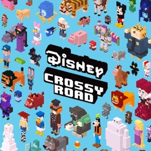

<div align="center">



# dcr_sea_nx

**Disney Crossy Road on Nintendo Switch**

An unofficial Nintendo Switch wrapper for the Android version of
**Disney Crossy Road**.

[](#)
[](#)
[](#)
[](#)

</div>

---

## About

`dcr_sea_nx` runs the 32-bit (armeabi-v7a) Android build of
**Disney Crossy Road** on Nintendo Switch. It loads the game's own Unity
5.6 and Mono libraries and recreates the Android, JNI, libc, audio, input and
graphics services they expect under Horizon OS. The whole program runs in
AArch32 (32-bit) mode, like the game.

It needs the **Southeast Asia edition** of Disney Crossy Road for Android,
**version 1.5.4** (`net.gogame.disney.crossyroad`, armeabi-v7a), published by
gogame. This is often labelled "Disney Crossy Road SEA". No game code is
included: you supply your own APK. The release NRO carries the five files the
DuckTales theme needs from the world-wide edition (its bundles, asset table
and logos), so no second APK is needed.

Added on top of the game, each one can be turned off in `config.ini`:

* Local multiplayer for up to 4 players, one controller each: Coin Crazy,
  Snatch and Run, and two new modes, Last One Standing and Hop Non-Stop.
* Switch profiles and a leaderboard of this console's high scores: Overall,
  By World and the current Weekend Challenge.
* The game's server answered on the console: weekly events, challenges, the
  ticket machine, free gifts and the daily reward work offline.
* Characters from the game's own files that were never released in this
  edition, including Sorcerer's Apprentice Mickey.
* The DuckTales theme from the world-wide edition, built into the release NRO.
* Controller navigation on every menu.

---

## Controls

| Input | Action |
| --- | --- |
| **A** | Hop, confirm |
| **Left Stick / D-Pad** | Move, menu highlight |
| **B** | Back |
| **+** | Pause |
| **L / R, ZL / ZR** | Change theme in the character select |
| **Y** | Random character in the character select |
| **X** | Character info |
| **-** | Save a screenshot of the game's picture |
| **Touchscreen** | Works as on a phone |

One controller plays: player 1, or the attached Joy-Cons when there is no
player 1.

Local multiplayer: the title's multiplayer button opens the Switch's
controller screen, then a mode. In the room, each player presses A to join
and Y to pick a character. Player 1 picks the world with L / R and starts the
match.

---

## Build

### Requirements

* Docker
* The AArch32 toolchain image `ghcr.io/vita2hos/devcontainer/vita2hos`
* [libnx32](https://github.com/aks796/libnx32) 4.12.0 or newer, the 32-bit
  libnx. Clone it next to this folder and run its `./build.sh`; `build.sh`
  mounts its `prefix/` from `../libnx32/prefix`. Set `DCR_LIBNX32` to use
  another path.
* [mesa32](https://github.com/aks796/mesa32): the `lib/` and `include/` of
  its `prefix/` (after its `./build.sh`) or of its release tarball, copied
  into `portlibs32/`.

Both have prebuilt releases, which work as well as building them.
* `devkitpro/devkita64` (the 64-bit launcher)
* `mcr.microsoft.com/dotnet/sdk:8.0` (the C# mod)
* Python 3

The mod is compiled against the game's own assemblies, made from your APK:

```bash
python3 tools/mod/publicize.py /path/to/your.apk
```

Compile the mod, the wrapper and the launcher:

```bash
mod/build_mod.sh
./build.sh
launcher/build.sh
```

The output is `launcher/dcr_sea_nx.nro`, which carries the 32-bit program
`dcrsea_nx.nsp`.

The release NRO is built with the DuckTales files from the world-wide edition
(Disney Crossy Road 3.x):

```bash
DCR_APK=/path/to/Disney+Crossy+Road_3.x.apk launcher/build.sh
```

See [NOTES.md](NOTES.md) for how the port works and what the 32-bit
libraries need.

---

## Running

Requires Atmosphère and [sphaira](https://github.com/ITotalJustice/sphaira).

Put the NRO and your APK in this folder:

```text
sd:/switch/dcr_sea_nx/
├── dcr_sea_nx.nro
└── Disney+Crossy+Road+SEA_1.5.4.apk
```

The APK file name does not matter. The DuckTales theme is already in the
NRO. A world-wide Disney Crossy Road 3.x APK in the folder, under any name,
is used instead if present.

1. In sphaira: **Homebrew > Disney Crossy Road > Install Forwarder**.
2. Launch the new **Disney Crossy Road** icon on the HOME menu. The
   launcher installs the 32-bit program for that icon and restarts.
3. The first start sets the game up from the APK with a progress bar. The
   APK is rewritten once uncompressed, which takes about a minute.

Afterwards the folder looks like this:

```text
sd:/switch/dcr_sea_nx/
├── dcr_sea_nx.nro
├── game.apk
├── config.ini
├── libmain.so
├── libunity.so
├── libmono.so
├── classes.txt
├── leaderboard.txt
├── data/
├── external/
├── profiles/
└── debug.log
```

Saves live in `data/`. Settings live in `config.ini`, which is written on the
first launch and explains each option.

To update, copy the new `dcr_sea_nx.nro` over the old one and launch the
icon. The game installs the newer build itself.

Coming from a build that used `sd:/switch/disneycrossyroadsea/`: its files
are moved into `sd:/switch/dcr_sea_nx/` on the first start.

To undo, delete `atmosphere/contents/<the forwarder's title id>/exefs.nsp`
and uninstall the forwarder.

---

## Status

The game, local multiplayer, the leaderboard, audio, controllers and the
touchscreen work on hardware.

Cloud saves, real ads and notifications are not available. The game runs
offline; its server is answered on the console.

The wrapper is built for the **Southeast Asia edition 1.5.4** of Disney
Crossy Road for Android, armeabi-v7a. Other versions have not been tested.

---

## Credits

**Disney Crossy Road Nintendo Switch port**: aks796

**Disney Crossy Road**: Hipster Whale and Disney. The Southeast Asia edition
is published by gogame.

The Android `.so` loader derives from the open-source Switch loader work by
Andy Nguyen (TheOfficialFloW) and fgsfds, ported to 32-bit with reference to
[vita2hos](https://github.com/xerpi/vita2hos) by xerpi.

The 32-bit toolchain and libnx port come from vita2hos. libnx is by the
switchbrew authors (ISC). Graphics use Mesa and libdrm_nouveau with
devkitPro's Switch patches.

Button pictures are drawn with the DejaVu fonts.

---

## Contributing

Bug reports and tested improvements are welcome. Include `debug.log` and, if
present, `crash.log` from `sd:/switch/dcr_sea_nx/`. If the game closed by
itself, include the newest report in `sd:/atmosphere/crash_reports/` as well.

---

## Disclaimer

This is an unofficial fan project and is not affiliated with, sponsored by or
endorsed by Nintendo, Disney, Hipster Whale or gogame. Disney Crossy Road and
all related characters and trademarks belong to their owners.

This repository contains no game code or assets. The release NRO includes
five files from the free world-wide edition for the DuckTales theme; they do
nothing on their own. You need your own copy of the game, the Southeast Asia
edition APK, to play.
